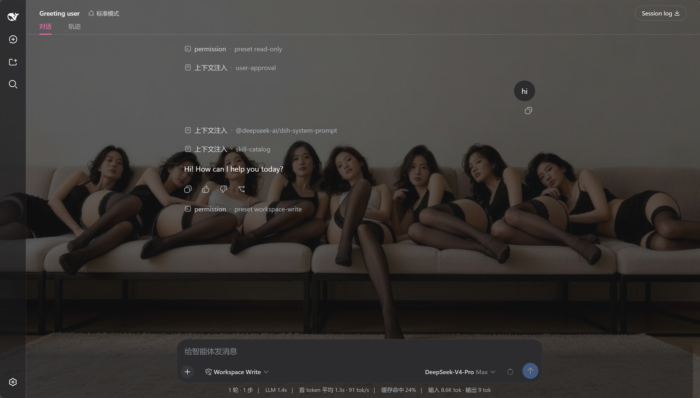
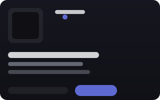
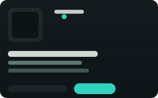
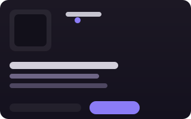
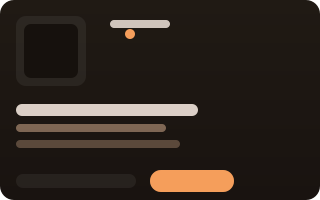
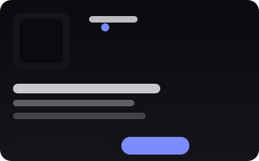

<p align="center">
  <a href="./README.md">中文</a> · <a href="./README.en.md">English</a> · <a href="./README.ja.md">日本語</a> · <a href="./README.ko.md">한국어</a> · <a href="./README.es.md">Español</a> · <a href="./README.fr.md">Français</a> · <a href="./README.de.md">Deutsch</a> · <strong>Русский</strong>
</p>

<div align="center">

# dsh-dream-skin 🔮

**Дайте DeepSeek Harness лицо, которое дышит, чувствует и принадлежит вам.**

Нативные темы · обои · распространяемые наборы тем — проект, созданный с душой и полностью построенный на официальной системе токенов `--dsw-*` от DSH.

> **Короче: код с атмосферой.** ✨

| 🎨 8 оригинальных тем | 🖼️ обои + прозрачность/размытие | 🌈 акцент в один клик | 📦 распространяемые наборы тем |
|---|---|---|---|

> Установка в одну строку · полностью нативно (без инъекций, без патчей установщика) · переживает обновления DSH

[中文](./README.md) · [История изменений](./CHANGELOG.md) · [Заметки о проекте](./docs/PROJECT.md) · [Руководство по публикации](./docs/publishing-to-npm.md)


[](https://awesome-dsh-plugin.com)


-4f83f2)


</div>

## ⚡ Установка в одну строку

**Скопируйте это предложение в свой DSH — и он установит всё за вас:**

> Установите, пожалуйста, плагин скинов dsh-dream-skin (https://github.com/RevolutionLA/dsh-dream-skin или npm-пакет `dsh-dream-skin`) и подскажите, как перезапустить DSH Web.

Предпочитаете CLI? Одна команда:

```sh
dsh plugin --profile web add dsh-dream-skin && dsh web
```

> 🚀 **Теперь и на npm!** Если DSH установлен, добавьте плагин одной командой — клонировать не нужно.

> **Дань уважения [Codex-Dream-Skin](https://github.com/Fei-Away/Codex-Dream-Skin).** Но подход другой:
> Codex внедряет CSS в рендерер десктопного клиента через CDP, тогда как DSH — это **управляемый токенами Web-GUI** с первоклассной
> поддержкой «сторонних плагинов, регистрирующих темы». Поэтому этот плагин **полностью нативный** — без инъекций, без бинарных
> патчей, и он не сломается при обновлении клиента.
>
> **Не официальный продукт.** Просто способ украсить ваше рабочее пространство DeepSeek Harness.

---

## 📸 Скриншоты

> Настоящие скриншоты, а не макеты. Слева: DSH после применения темы; справа: специальный раздел **Тема / Внешний вид** в Настройках.

<p align="center">
  
  &nbsp;&nbsp;
  
</p>

---

## 🏆 Почему он заслуживает звёздочку (по сравнению с альтернативами)

| Возможность | Наш | Другие темы DSH | Codex-Dream-Skin (десктоп) |
|------|:---:|:---:|:---:|
| Нативные токен-темы — без инъекций и патчей установщика | ✅ | ✅ | ❌ (инъекция через CDP) |
| Свои обои + прозрачность/размытие | ✅ | частично | ✅ |
| **Импорт/экспорт наборов тем + ссылки для обмена** | ✅ | ❌ | ✅ (zip-наборы) |
| **Акцентная переопределяемая тема для каждого пользователя** | ✅ | ❌ | частично |
| **Обои 2.0 (URL / градиент / предложение под тему / авто-затемнение)** | ✅ | ❌ | ✅ |
| Локальная библиотека наборов + избранное + «удиви меня» | ✅ | ❌ | частично |
| Проверка + откат | ✅ | частично | ✅ |
| **Веб-GUI в браузере, кроссплатформенно из коробки** | ✅ | ✅ | ❌ (нужно десктопное приложение) |

## ✨ Возможности

| Возможность | Описание |
|------------|-------------|
| 🎨 **8 встроенных пресетов (Mirage)** | Мгновенное переключение в **Настройки → Тема / Внешний вид**, светлая и тёмная |
| 🖼️ **Свои обои** | Выберите локальное изображение (автосжатие ≤2 МБ), настройте **прозрачность / размытие** |
| 🔤 **Непрозрачные внутренние поверхности** | Карточки, поля ввода, пузыри сообщений остаются читаемыми — никогда не «выцветают» |
| ↩️ **Восстановление по умолчанию** | Один клик назад к встроенному виду DSH (следовать за системой) |
| 💾 **Локальное сохранение** | Тема и обои хранятся в `localStorage`, переживают перезагрузку |

## 🚀 Продвинутые возможности (P0)

Дифференциация вдохновлена существующими проектами тем для DSH плюс UX тем от Codex:

| Возможность | Описание |
|------------|-------------|
| 📦 **Формат набора тем + импорт/экспорт** | Набор `*.dsh-theme.json` = маркер формата + версия + манифест (id/имя/автор/scheme/акцент/токены). Импортируйте файл, применяйте в один клик и копируйте **ссылку для обмена** (закодированную в хэше URL) |
| 🌈 **Акцент для каждого пользователя** | Накладывайте фирменный акцент поверх активной темы (слой `overrideTokens`, сама тема не трогается): **12 пресетов-образцов в один клик**, пипетка цвета, **случайный выбор** и сброс |
| 🖼️ **Обои 2.0** | Локальное изображение / **URL изображения** / **пресеты градиентов**, с **предложенным градиентом под каждую тему** и **авто-затемнением**; **Недавние** (до 5) для возврата в один клик |
| 🧩 **Локальная библиотека наборов** | Все импортированные наборы тем в одном месте; **применить / в избранное / удалить** в один клик (8 встроенных тем живут в ряду Тем) |
| ✅ **Чёткая обратная связь о выборе** | Переключение тем мгновенно обновляет выделение галочкой/рамкой — никаких устаревших белых рамок |
| 🎲 **«Удиви меня»** | Случайное переключение на тему, отличную от текущей |
| ⭐ **Избранное** | Помечайте любимые темы звёздочкой и быстро переключайтесь между ними |
| ✅ **Проверка + откат** | Импорт набора проверяет формат / обязательные токены / корректность цветов; при сбоях или удалении происходит безопасный откат |

## ⚡ Быстрый старт (3 шага)

```sh
# 1. install
dsh plugin --profile web add dsh-dream-skin
# 2. restart
dsh web
# 3. open Settings → Theme / Appearance → pick a skin → done.
```

> Устанавливается опубликованный npm-пакет — клонирование не нужно. Если `dsh plugin add` сообщает об ошибке workspace, добавьте флаг `-w`.

## 🧩 Что это за плагин

**Стандартный двуликий «всё есть плагин» `dsh-plugin` — загружается и используется точно так же, как официальный пакет `ui-theme`.**

Девиз DeepSeek Harness — *всё есть плагин*: модели, инструменты, песочницы, сессии, UI и даже сам Agent Loop
являются плагинами. `dsh-dream-skin` поставляет темы как npm-пакет, который **изоморфен официальным UI-пакетам**:

```text
            ┌──────────── dsh-dream-skin (standard dsh-plugin / dual-face) ─────────────┐
            │  dsh.bundle   → cordis.patch.yml inserts the dream-skin entry  (host half)│
            │  dsh.client   → lib/client.js (browser bundle)                (browser half)│
            └───────────────────────────────────────────────────────────────────────────┘
```

- **Команда установки = официальная**: `dsh plugin --profile web add dsh-dream-skin`
- **Использует официальные точки расширения**: `ctx.theme` (регистрация тем), `ctx.theme.overrideTokens` (слои переопределений),
  `ctx.slots` (монтирование UI в специальный раздел **Настройки → Тема / Внешний вид**).
- **Контракт манифеста совпадает с официальными пакетами**: `dsh.bundle` + `dsh.client` + `exports["./client"]`.

Иными словами: вы устанавливаете не сомнительный скрипт — это стандартный плагин тем внутри официальной системы
плагинов DSH.

## 🖼️ Превью — серия Mirage

> Превью ниже генерируются из **реальных токенов** каждой темы — что видите, то и получаете.

<table>
  <tr>
    <td align="center"><br/><b>abyss</b></td>
    <td align="center"><br/><b>aurora</b></td>
    <td align="center"><br/><b>nebula</b></td>
    <td align="center"><br/><b>ember</b></td>
  </tr>
  <tr>
    <td align="center"><br/><b>midnight</b></td>
    <td align="center"><br/><b>ivory</b></td>
    <td align="center"><br/><b>mist</b></td>
    <td align="center"><br/><b>rose</b></td>
  </tr>
</table>

## 🎲 Пресеты

| id | scheme | атмосфера |
|------|--------|------|
| `abyss` | 🕶️ тёмная | глубоко-синяя бездна DeepSeek (якорная) |
| `aurora` | 🌌 тёмная | бирюзово-зелёное северное сияние |
| `nebula` | 🪐 тёмная | космический фиолетовый |
| `ember` | 🔥 тёмная | тёплый оранжевый уголёк |
| `midnight` | 🌚 тёмная | чисто-чёрный OLED |
| `ivory` | 📜 светлая | тёплый айвори / бумага |
| `mist` | 🌫️ светлая | прохладная голубая дымка |
| `rose` | 🌸 светлая | розовый / румянец |

## 📦 Установка

Выберите любой из четырёх вариантов, затем **перезапустите DSH Web** (текущая сессия прервётся, но сессии DSH
сохраняются на диск и восстанавливаются после перезапуска).

### Вариант A: из npm (опубликован, **рекомендуется**)

```sh
dsh plugin --profile web add dsh-dream-skin
```

### Вариант B: из GitHub (привязка к проверенному коммиту)

```sh
dsh plugin --profile web add 'github:RevolutionLA/dsh-dream-skin#<40-char-commit>'
```

> Привязка к коммиту релиза означает, что новые изменения в `main` никогда незаметно не изменят вашу установленную копию.

### Вариант C: из tarball релиза (офлайн / без git)

Скачайте `dsh-dream-skin-<version>.tgz` со страницы [Releases](https://github.com/RevolutionLA/dsh-dream-skin/releases)
(в нём уже собран `lib/client.js`, так что prepare-скрипт при установке не запускается), затем:

```sh
dsh plugin --profile web add ./dsh-dream-skin-<version>.tgz
```

### Вариант D: клонировать и установить из локального пути (разработка)

```sh
git clone https://github.com/RevolutionLA/dsh-dream-skin.git
cd dsh-dream-skin
dsh plugin --profile web add .
```

> `dsh plugin` привязывает относительные пути к каталогу, **из которого вы запускаете команду**, устанавливая ссылочную
> зависимость, указывающую на ваш клон: правите исходники, сохраняете, перезапускаете DSH — переустановка не нужна.

**Перезапуск и проверка:**

```sh
dsh web
dsh --profile web --dump-config | grep -A2 dream-skin   # a dream-skin loader entry should appear
```

Откройте **Настройки → Тема / Внешний вид**, чтобы увидеть ряды **Темы**, **Акцент**, **Обои** / **Расширенные обои** и **Наборы тем**.

> Флаг `-w` (workspace) нужен при простом `add`, потому что каждый профиль поставляется с `pnpm-workspace.yaml`; pnpm
> считает каталог профиля корнем workspace, поэтому простое добавление падает с ошибкой `ERR_PNPM_ADDING_TO_ROOT`. Если ваш
> профиль уже использует workspace, повторять флаг не придётся.

## 🔄 Обновление / Удаление

**Обновление до последней версии** (при установке из npm-релиза):

```sh
dsh plugin --profile web update dsh-dream-skin
dsh web   # restart to pick it up
```

> Застряли на старой версии после обновления? Политика pnpm по минимальному возрасту релиза (supply-chain) может
> придерживать свежеопубликованный релиз. В каталоге профиля выполните:
> `pnpm add dsh-dream-skin@latest --config.minimumReleaseAge=0`, чтобы принудительно обновить.

**Удаление:**

```sh
dsh plugin --profile web remove dsh-dream-skin
dsh web   # restores the official appearance
```

## 🧩 Совместимость

| Пункт | Значение |
|------|-------|
| DeepSeek Harness (`dsh`) | `0.1.0-rc.6` (peerDependencies зафиксированы как `^0.1.0-rc.6`) |
| Node.js | `>=18` |
| Браузер | современный Chromium / WebKit (нативные CSS-переменные и `matchMedia`) |

> При обновлении DSH не забудьте соответственно поднять peerDependencies в `package.json`.

## ⚙️ Как это работает

Система тем DSH основана на токенах: веб-оболочка поставляет дизайн-токены `--dsw-*`, а `ThemeRuntime` позволяет сторонним
плагинам регистрировать темы, переопределяющие слой алиасов (`--dsw-alias-*`). Этот пакет — стандартный двуликий плагин:

```text
                ┌─────────────────────────────────────────────┐
                │          dsh-dream-skin (dual-face plugin)    │
                ├────────────────────────────┬────────────────┤
    Host half   │  lib/index.js              │  Browser half  │
                │  cordis.patch.yml inserts  │  lib/client.js │
                │  dream-skin loader entry   │  __ModuleLoader__│
                └────────────────────────────┴────────────────┘
                             │                         │
                     profile tree loaded      /plugins/dsh-dream-skin/client.js
                                                          │
        ┌────────────────────────────────┬────────────────┐
        │                                │                │
   ctx.theme.register(8 skins)     ctx.theme.overrideTokens(wallpaper)   ctx.slots.inject('settings.section' + 'settings.dreamSkin.item')
```

- **Хост-часть** (`lib/index.js`) — патч-слой `dsh.bundle`, вставляющий запись загрузчика `dream-skin`; `apply` — это
  no-op, ровно как у поставляемых пакетов `ui-*`.
- **Браузерная часть** (`lib/client.js`):
  1. регистрирует 8 тем через `ctx.theme.register(...)`;
  2. восстанавливает сохранённую тему и применяет её через `ctx.theme.setTheme(...)`;
  3. отрисовывает обои как фиксированный фон с `z-index:-1` и накладывает `ctx.theme.overrideTokens(...)`, делая
     основной холст (`--dsw-alias-bg-base`) и боковую панель (`--dsw-specific-sidebar-fill`) полупрозрачными;
  4. слушает `theme/change` и перекрашивает подложку обоев при смене темы / схемы;
  5. регистрирует специальный раздел **Настройки → Тема / Внешний вид** (`settings.section`) и монтирует пять рядов
     возможностей в слот `settings.dreamSkin.item`.

Каждая тема несёт свой `colorScheme` (`light`/`dark`), управляющий `body[data-ds-dark-theme]`; переопределения алиас-токенов
применяются как инлайновые custom properties на `<body>` через ThemePresenter из ui-layout.

## 💼 Заметки о сохранении

- Тема и обои хранятся в `localStorage` (ключи с префиксом `dsh-dream-skin:`), **для каждого браузера**.
- Почему не в настройках Host? Проводка настроек Host предоставляет браузерным клиентам только разрешённый список
  пространств имён (`WEB_SETTINGS_NAMESPACES` в `dsh-host-apiproxy`), поэтому стороннее пространство имён ответит
  `settings-not-exposed`; сам продукт хранит удалённые браузерные предпочтения локально для процесса. `localStorage`
  соответствует этой границе и переживает перезагрузки.

## 🛠️ Разработка / расширение тем

Браузерный бандл написан напрямую в формате `__ModuleLoader__` (тот же вид, что tsdown выдаёт для поставляемых пакетов
`ui-*`), так что **шаг сборки не нужен**. `lib/client.js` может `require` только сущности модульной таблицы: сиды платформы
(`react`, `react/jsx-runtime`, …) и зарегистрированные клиентские бандлы (`@deepseek-ai/dsh-client-runtime/client`, …).

- **Добавить встроенную тему**: добавьте объект (`id` + `colorScheme` + `tokens`) в массив `SKINS` в `lib/client.js`;
  она появится в Настройках автоматически. Добавьте ключ `skin.<id>` во **все 8 словарей языков** (`zh`/`en`/`ja`/`ko`/`es`/`fr`/`de`/`ru`).
- **Поставлять набор тем (рекомендуется)**: следуйте [`docs/examples/sample-theme-pack.json`](./docs/examples/sample-theme-pack.json) —
  любой `*.dsh-theme.json` импортируется в Настройках и распространяется по ссылке, без изменений кода.
- **Добавить свои обои**: положите изображения в [`wallpapers/`](./wallpapers/) (распространяйте только то, на что у вас
  есть права), затем импортируйте их через ряд «Обои» в DSH.
- **Проверка**: `npm test` (VM-смоук-тесты: factory eval, `apply()`, импорт набора и сохранение).
- **Перекраска**: используйте токены `--dsw-alias-*` (полный контракт в [`docs/themes-spec.md`](./docs/themes-spec.md)).

## 📌 Дорожная карта

- [x] v0.1: 8 тем + свои обои (прозрачность / размытие) + локальное сохранение
- [x] Формат набора тем + импорт / экспорт / ссылка для обмена (JSON + манифест + проверка)
- [x] Акцент для каждого пользователя + случайный выбор
- [x] Обои 2.0 (URL / градиент / предложение под тему / авто-затемнение)
- [x] Локальная библиотека наборов + применение в один клик / избранное / «удиви меня»
- [x] Полная i18n-локализация текстов и документации (zh / en / ja / ko / es / fr / de / ru)
- [ ] Онлайн-студия палитр / превью тем (чистый фронтенд, проверка контраста)
- [ ] Галерея тем сообщества (приём наборов в репозиторий / онлайн-галерея)
- [ ] Улучшение первого рендера (FOUC)

## 🤝 Вклад

Приветствуются issue и PR! Пожалуйста, прочитайте [Руководство по вкладу](./CONTRIBUTING.md) и соблюдайте
[Кодекс поведения](./CODE_OF_CONDUCT.md).

## ⭐ Поддержите проект

Если вам нравится: поставьте звёздочку **⭐** репозиторию, лайк **👍** на npm или поделитесь с друзьями по DSH — это
помогает проекту находить аудиторию и оставаться поддерживаемым. Хотите добавить темы / онлайн-студию / больше скинов?
Присоединяйтесь.

## 🔒 Безопасность

Нашли проблему с безопасностью? Не открывайте публичный issue — см. [Политику безопасности](./SECURITY.md).

## 📄 Лицензия

[MIT](./LICENSE)

## 🙏 Благодарности

- Архитектура и справочник по API: официальный клиентский пакет DeepSeek Harness
  [ui-theme](https://github.com/deepseek-ai/deepseek-harness/tree/master/packages/client/ui-theme).
- Концептуальная дань: [Codex-Dream-Skin](https://github.com/Fei-Away/Codex-Dream-Skin).
